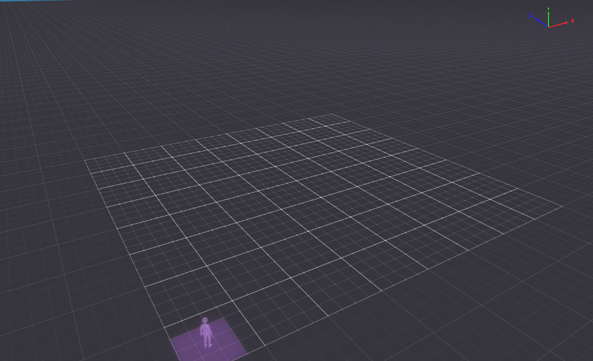

# 💗 Social Quest



**Social Quest** is a mobile-first multiplayer social game for **Decentraland**. Players meet inside the Quest Zone, answer fun A/B questions together, discover how much they have in common, earn **Social Points**, and build persistent friendships over time.

🌍 **Live World:** [Play Social Quest in Decentraland](https://decentraland.org/jump?realm=socialquest.dcl.eth&position=0,0&referrer=0xe339ebc7ec708bf42eed1b54a4df852312db2c5b)  
📱 Designed and tested for **desktop and mobile**  
🎮 Built with **Decentraland SDK7 + TypeScript**

> **Play together. Discover your connection. Build your social story.**

---

## ✨ What is Social Quest?

Social Quest turns meeting another player into a lightweight social game.

Two or more players can enter the **Quest Zone** and take part in synchronized rounds. Each player chooses between two answers, the results are revealed together, and every valid response contributes to an evolving social profile.

The experience is designed around a simple idea: **give players a reason to meet, interact, remember each other, and come back.**

---

## 🎮 How to Play

1. Enter the **Quest Zone**.
2. Wait for another player to join.
3. Answer each question with **A** or **B**.
4. Reveal the answers together.
5. Earn **Social Points** for valid participation.
6. Build affinity and friendship progress with the people you meet.
7. Open the **Social Agenda** to review your connections.
8. Check the **Leaderboard** to see top players and top matches.

The question system includes a large curated bank of social prompts across multiple categories, helping repeated sessions stay varied.

---

## 💕 Persistent Friendship System

Social Quest tracks repeated interactions between players and lets relationships grow over time.

Friendship progression includes:

- **New Connection**
- **Spark**
- **Familiar Face**
- **Friends**
- **Close Friends**
- **Cosmic Bond**
- **Friends Forever**

Playing together increases shared history and can unlock friendship milestones and Social Point bonuses.

---

## 📔 Social Agenda

The **Social Agenda** is the player's persistent social history.

For every connection, it can show:

- Player name
- Affinity percentage
- Shared answers
- Rounds played together
- Friendship tier

The Agenda includes responsive pagination and dedicated layouts for desktop, narrow desktop windows, and mobile.

---

## 🏆 Leaderboards

Social Quest includes two complementary ranking systems.

### Social Points

Ranks individual players by their accumulated Social Points.

### Top Matches

Highlights the strongest player connections using shared social history and affinity.

Top Matches includes:

- **This Week**
- **All Time**

A dedicated **3D leaderboard** is also integrated directly into the world, so rankings are part of the environment instead of existing only as UI.

---

## 📱 Mobile-First UI

Social Quest was built with Decentraland's mobile experience in mind.

The interface adapts to:

- Desktop
- Narrow desktop windows
- Mobile landscape

Mobile-specific work includes touch-friendly controls, independent UI scaling, safe positioning around native Explorer controls, responsive panels, readable typography, and compact pagination.

---

## 💾 Persistence

Progress is designed to survive beyond a single visit. Social Quest persists social data including:

- Social Points
- Player connections
- Friendship progression
- Shared-answer history
- Leaderboard data

Players can leave and return later without starting their social journey from zero.

---

## 🌐 Multiplayer

The World is configured for **authoritative multiplayer** and synchronizes the shared Social Quest experience between participants.

The multiplayer flow covers:

- Player joining and pairing
- Shared round state
- Synchronized answers and reveals
- Late-answer handling
- Leave and re-entry behavior
- Persistent progression updates
- Multiplayer leaderboard updates

---

## 🧠 Question System

Social Quest includes **500 curated questions** organized across multiple social categories, including icebreakers, personality, lifestyle, funny, fantasy, deep, gaming, metaverse, and chaos-style prompts.

Questions use stable IDs and deterministic shuffled-cycle behavior to support synchronized multiplayer sessions while reducing repetition.

---

## 🛠 Tech Stack

- **Decentraland SDK7**
- **TypeScript**
- **Decentraland Creator Hub**
- **Authoritative Multiplayer**
- **CRDT-based synchronization**
- **Persistent Storage**
- **Blender** for optimized 3D assets
- Custom responsive UI for desktop and mobile

---

## 🎨 Visual Design

Social Quest uses a playful, friendly visual identity built around:

- Pink and cream tones
- Hearts and friendship motifs
- Rounded social UI
- A cozy multiplayer lounge
- Integrated 3D social displays
- Clear mobile-first visual hierarchy

The environment, interface, icons, 3D props, and interaction flow were created specifically for the Social Quest experience.

---

## 📸 Screenshots

Selected screenshots for the final submission:

- Social Quest World / Quest Zone
- Mobile gameplay
- Social Agenda
- Leaderboard

---

## 🚀 Run Locally

Requirements:

- Node.js 16+
- npm 6+

Install dependencies:

```bash
npm install
```

Start the Decentraland preview:

```bash
npm run start
```

Build the project:

```bash
npm run build
```

---

## 🌍 Play Social Quest

Open Decentraland and enter the World:

**[Play Social Quest](https://decentraland.org/jump?realm=socialquest.dcl.eth&position=0,0&referrer=0xe339ebc7ec708bf42eed1b54a4df852312db2c5b)**

Then walk into the Quest Zone and meet another player to begin.

---

## 💗 Social Quest

**Meet. Play. Connect. Remember.**
